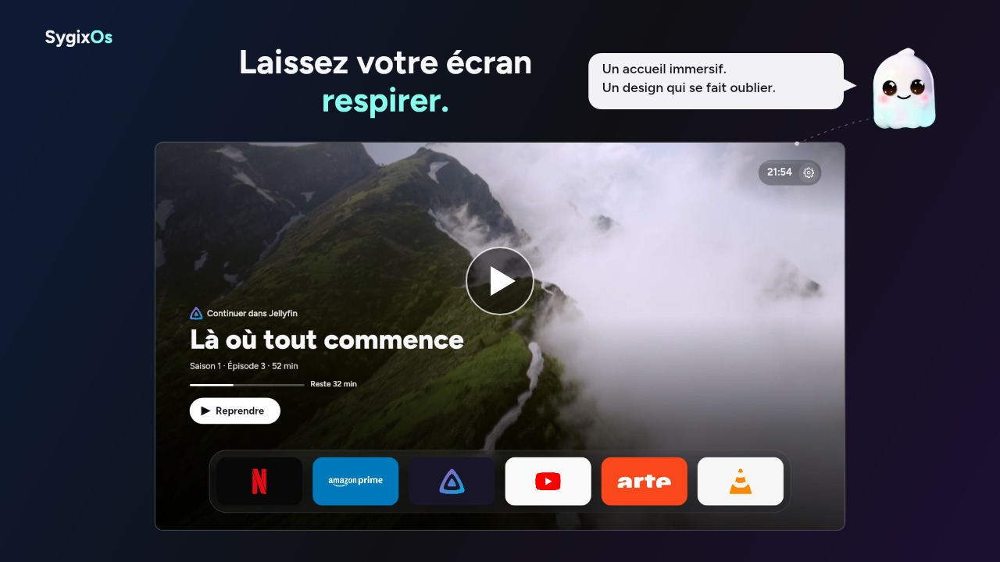

<h1 align="center"></h1>

[](https://github.com/Sygix/SygixOs/actions/workflows/test.yml)
[](https://github.com/Sygix/SygixOs/releases)
[](LICENSE)

A free and open source launcher for Android TV / Google TV, inspired by tvOS 26: dark Liquid Glass, polished focus and animations, the Figtree typeface, **no ads**. It showcases the content published by your installed apps (Jellyfin, Netflix, Prime Video…) through the Android TV Provider, with no server and no account.

> Independent project, not affiliated with Apple, Google or TCL. Apple TV and tvOS are trademarks of Apple Inc.; Android TV and Google TV are trademarks of Google LLC.

## Your TV, without the clutter

An immersive home screen, fluid navigation, and your apps where you want them. See SygixOs in this **41-second presentation** (French · Full HD · 60 fps).

[](.github/assets/sygixos-promo.mp4)

[▶ Watch or download the video](.github/assets/sygixos-promo.mp4)

Music: **“Electric Dreams” by Scott Buckley**, released under [CC BY 4.0](https://creativecommons.org/licenses/by/4.0/) — [www.scottbuckley.com.au](https://www.scottbuckley.com.au/library/electric-dreams/). Edited excerpt with original sound effects. Nature footage and demonstration artwork: [Pexels](https://www.pexels.com/license/).

## Features

- **Startup screen**: on a cold start, the SygixOs ghost mascot floats and blinks alone on a black background (no icon or second screen from the system before it), for at least 0.6 s and until the home screen is ready (app catalog loaded and first hero picture ready, at most 5 s), then crossfades into the hero. It never shows when you come back to the launcher. With animations turned off in the system, the mascot stays still and the home screen appears without a fade.
- **Full-screen hero**: a muted slideshow (crossfade, one slow zoom per picture, then still) of the programs published by installed apps (continue watching, new releases, recommendations). It plays the preview video when the app provides one, otherwise the poster. Above the title, the source app's icon and a label that depends on what the app published: "Continuer dans X" (continue watching), "Épisode suivant dans X" (next episode), "Nouveau dans X" (new), "À regarder dans X" (watchlist), or just the app name for a highlighted program. Under the title, only the details the app provides (season, episode, duration, e.g. "Saison 2 · Épisode 5 · 42 min"), and a progress bar with the time left ("Reste 25 min") when the playback position and the duration are known. Soft dark veils keep the text and button readable on bright posters. The "Open" / "Resume" button opens the content page in its app.
- **Clock and settings capsule**: a small dark glass capsule at the top right of the hero shows the time (12 or 24-hour, as set on the TV) and the settings gear.
- **Up Next**: the "À suivre" section combines Watch Next programs from all enabled source apps, deduplicates matching episodes and movies, and preserves each app in the "Ouvrir avec…" menu. The "Applications" section remains separate; Up Next can sit before or after it. Program artwork falls back to a placeholder when absent or below twice the displayed width.
- **Dock and app grid**:
  - apps are detected automatically;
  - 16:9 tiles show the Android TV banner;
  - the focused tile lifts like on tvOS (zoom, soft shadow, light sheen), with no app name on the tiles;
  - up to 6 apps can be pinned to the dock, a dark glass bar whose tiles keep one fixed size;
  - the grid can be reordered with the arrow keys.
- **Dark glass**: the dock, the capsule, the context menu and the move-mode banner use a dark translucent glass with a live blur computed at reduced resolution, only under these surfaces.
- **Top Shelf-style preview**: after about 3 s on an app that publishes content, its artwork appears above the row and pans slowly once.
- **Settings** (gear in the capsule, same background as the grid, light focus pills):
  - choose which apps feed the hero, preview and Up Next; apps that publish content come first, by the combined number of Preview and Watch Next programs, then the others alphabetically. The order is set when you open the category, so rows never move under the focus;
  - "Écran d'accueil" contains "Afficher Up Next" (on by default) and "Position d'Up Next" (before applications by default). Changes apply immediately and persist; position remains editable when Up Next is off. Below them, under "Launcher système", the same three controls as the introduction (see System launcher): "Remplacer le launcher", "Démarrer à l'allumage" and "Retour à l'accueil", each with its live state ("Actif", "En attente…", "Inactif" or "Indisponible");
  - hide apps from the grid, and restore them: the hidden apps are listed right in the settings pane, most recently hidden first, with a "Tout réactiver" (restore all) button above the list that restores the listed apps. A restored app keeps its row (switched to visible) until you leave the category, so a mistake can be undone at once;
  - version and library licenses;
  - updates: "Vérifier les mises à jour" (check for updates) asks the public GitHub releases of this repository, with no account and no token; "Mettre à jour vers X" (update to X) downloads, verifies and installs the new version, with a QR code next to it that opens the release notes on a phone; "Inclure les préversions" (include pre-releases) is off by default.
- **System launcher**: after the startup screen and the TV-programs permission answer, a one-time introduction offers three optional controls, also available later in Settings → "Écran d'accueil": "Remplacer le launcher" (asks Android for the HOME role), "Démarrer à l'allumage" (open SygixOs when the TV starts, off by default) and "Retour à l'accueil" (optional accessibility service for TVs that send the Home key to their own launcher). Nothing is enabled without your action; "Continuer", Back or Home closes the introduction for good. Pressing Home while SygixOs is already in front closes settings and menus, scrolls back to the top and focuses the hero.
- **Self-update**: at startup and when you come back to the home screen, at most once a day, SygixOs checks for a new version in the background. It only signals it with a small blue dot on the settings gear and on "À propos": nothing is ever downloaded or installed without you pressing "Mettre à jour vers X".
- **Never a black screen**: falls back to nature clips (Pexels), then to a gradient that drifts once and settles.
- **Fully local**: no backend, no telemetry, no hard-coded app list.

## Roadmap

| Phase | Scope | Status |
|---|---|---|
| P1 | Scaffold, Liquid Glass design system, app grid, dock | ✅ done |
| P2a | Full-screen hero fed by the TV Provider, Top Shelf preview, nature fallback | ✅ done |
| P2b | Settings: source apps, hidden apps, about | ✅ done |
| Polish | Home fixes: settings gear, grid and dock refresh, Top Shelf placement | ✅ done (v0.0.1-rc.2) |
| Polish | Continuous hero/grid scroll, hidden apps in the settings panel, source apps sorting | ✅ done (v0.0.1-rc.4) |
| Polish | tvOS 26 dark glass, focus, readability, concentric corners and smoother grid | ✅ delivered in v0.0.1; historical TV checks still pending documentation |
| P3 | Logo and animated startup splash | ✅ delivered in v0.0.1; splash cadence follow-up remains |
| P4 | Built-in updates from GitHub releases | ✅ delivered in v0.0.1; manufacturer-blocked relaunch to be checked with the HOME role in P5 |
| P5 | Replacing the system launcher | [Implementation](openspec/changes/p5-real-launcher/tasks.md) in progress; real-TV acceptance pending |
| P6 | Up Next row (all apps, deduplication) | [Implementation](openspec/changes/up-next/tasks.md) in progress; independent review and real-TV acceptance pending |
| P7 | Shizuku: disable the stock home screen from SygixOs (the manual ADB procedure, built in) | [Spec](openspec/changes/p7-shizuku/proposal.md) in review |
| P8 | Search | planned |
| P9 | BetaSeries (OAuth): Up Next enrichment and reliability | planned |

Detailed requirements for each feature live in [`openspec/specs/`](openspec/specs), and ongoing changes in [`openspec/changes/`](openspec/changes). Follow-ups deferred after v0.0.1, not specified yet, are tracked in [`openspec/backlog.md`](openspec/backlog.md). Specs and the user interface are written in French.

## Requirements

- Android TV or Google TV on **Android 14 or later** (minSdk 34)
- Tested on a TCL Google TV (Android 14)

## Installation

1. On the TV: Settings → About → press "Build" 7 times (developer mode), then enable ADB debugging.
2. Download `app-release.apk` and `app-release.dm` from the [Releases](https://github.com/Sygix/SygixOs/releases) page.
3. Install both files together:
   ```
   adb connect <TV-IP>:<port>
   adb install-multiple app-release.apk app-release.dm
   ```
   `app-release.dm` is the startup profile of this APK (Android "dex metadata"): installed with it, the app is compiled for a fast start right away instead of running interpreted until the system compiles it in the background. `adb install -r app-release.apk` alone also works, without that head start. Check with `adb shell dumpsys package fr.sygix.sygixos | grep status=`: `[status=speed-profile] [reason=install-dm]` means the profile was applied (`verify` without it).
4. On first launch, grant the "TV programs" permission (`READ_TV_LISTINGS`). Without it, the hero cannot see other apps' content.

ADB is only needed for this first installation. Later versions install from the app: Settings → About → "Vérifier les mises à jour", then "Mettre à jour vers X". The download goes on if you leave the settings or open another app, and the new version is available when you return to SygixOs. Automatic relaunch is not guaranteed: on the reference TV, the manufacturer's auto-start policy blocks it even after a foreground update. Whether holding the HOME role (P5) lets Android bring SygixOs back is still to be checked on the reference TV; P5 adds no other relaunch mechanism, so if it stays blocked, reopen SygixOs manually. The first time, Android may ask you to allow SygixOs to install unknown apps: accept, and the update carries on. The startup profile (`app-release.dm`) is installed with the update when the release provides it with a SHA-256 digest that matches; otherwise, or if Android refuses it, the update is installed without it. An update is installed only if its size, its SHA-256 digest published by GitHub, its package name, its version and its signing certificate all match; a build signed with another key (for example a local debug build) is refused with "Signature différente de l'app installée".

SygixOs declares itself as a possible home screen (`CATEGORY_HOME`). It asks for the HOME role only when you press "Remplacer le launcher" in the introduction or in Settings → "Écran d'accueil", never on startup or during a self-update; when the role dialog is unavailable, it opens Android's home or default-apps settings instead, if the TV has them. No system component is disabled automatically.

"Démarrer à l'allumage" is off by default and covers a cold boot only; waking the TV from standby is not covered yet. When you turn it on and the "Afficher par-dessus d'autres applis" permission is missing, SygixOs explains why Android may need it and offers "Ouvrir les réglages" or "Pas maintenant"; declining keeps your choice, and the permission never guarantees an automatic start. If the TV has no such settings screen, or it cannot open, "Démarrer à l'allumage" shows "Indisponible" and cannot be turned on. Manufacturer boot policies can still block the boot broadcast or the opening of SygixOs: the detail "SygixOs ne s'est pas ouvert automatiquement à ce démarrage" then shows in the settings after a boot without an observed opening.

"Retour à l'accueil" opens Android's accessibility settings: the service must be enabled there by you. It only watches the Home key and never blocks it: a short press brings SygixOs back (the manufacturer's home may flash briefly first), a long press keeps its system behaviour (for example the Google TV dashboard). It reads no screen content and does nothing on TVs that do not deliver that key to it. HOME-role support, boot reliability and relaunch after an update still need release validation on the reference TV.

As a manual alternative (not required by the app's setup flow), you can make SygixOs the only possible home screen by disabling the Google TV launcher (reversible):
```
adb shell pm disable-user --user 0 com.google.android.apps.tv.launcherx
adb shell pm disable-user --user 0 com.google.android.tungsten.setupwraith
```
Restore with `adb shell pm enable <package>`. Use at your own risk: disabling the stock launcher may behave differently depending on the TV model.

## Navigation

Remote control (D-pad) only, three tiers: hero → dock (pinned apps, at the bottom of the hero) → grid. The home screen is a single page: the hero fills the first screen, with the dock and the clock and settings capsule on it, and the grid sits below. Going from the dock to the grid scrolls the page in one continuous move: the hero, the dock and the capsule slide out at the top while the grid comes up, back to where you left the grid. Up from the first row, or Back, scrolls back.

- **Down / Up**: switch tiers; only the active zone takes focus.
- **Left / Right**: stay within the zone (previous or next program on the hero).
- **Up from the hero**: settings gear (the clock never takes the focus); Back from the gear returns to the hero button.
- **Back**: returns to the hero.
- **Long press OK** on a tile opens a dark menu (Up / Down to choose, Back to close):
  - pin to or unpin from the dock;
  - "Move" to reorder the grid with the arrows (OK confirms, Back cancels);
  - "Hide".

## How the hero works

The hero reads the programs apps publish to the TV Provider (`content://android.media.tv`, watch next and preview programs), and opens each item through the intent provided by the app. It reloads every time you return to the launcher.

- **Artwork validated before display**: a preview video, or an image or video at least 1080 px wide. A program without suitable artwork is left out of the slideshow.
- **Progressive validation**: the TV Provider can hold hundreds of programs, so only the first hero visuals are validated at startup, and an app's posters once the focus rests on its tile for half a second.
- **Text follows the picture**: the title, details and button change together with the picture, never before it. A program whose picture is not ready within 1 s (some apps serve their pictures slowly through their own content provider) is skipped; its picture keeps loading in the background and the program comes back once it is ready.
- **Optional fields**: the program type (`watch_next_type`), season and episode numbers, duration and playback position are all optional; whatever an app leaves out is simply not shown.
- **Instant startup**: the app catalog is cached.

## Building from source

Requirements: JDK 21, Android SDK with platform and build-tools 37.
```
./gradlew testDebugUnitTest      # JUnit / Robolectric tests
./gradlew assembleRelease        # APK to test on the TV
./gradlew dexMetadataRelease     # its startup profile, app/build/outputs/dexmetadata/release/app-release.dm
```
Without a local SDK, use a throwaway container (Docker or Podman; amd64 is required because adb and aapt2 are x86_64):
```
docker run -d --name sygixos-build --platform linux/amd64 -v "$PWD":/work -w /work \
  -v sygixos-gradle:/root/.gradle ghcr.io/cirruslabs/android-sdk:34 sleep infinity
docker exec sygixos-build sdkmanager "platforms;android-37.0" "build-tools;37.0.0"
docker exec sygixos-build ./gradlew testDebugUnitTest assembleRelease
```
On Fedora or any other SELinux system, add `:z` to the mount (`-v "$PWD":/work:z`). Give the container about 4 GB of memory. Run `./gradlew --stop` before a build session, so leftover Gradle daemons don't get the build killed.

**Performance:** the `debug` build interprets bytecode and stutters on the TV. Always judge smoothness on `assembleRelease` (R8). To measure next to an installed release, `./gradlew assemblePerf` builds `fr.sygix.sygixos.perf` ("SygixOs perf"): same R8 build signed with the debug key, not declared as a home app, profileable from the shell; `./gradlew dexMetadataPerf` builds its startup profile (`app/build/outputs/dexmetadata/perf/app-perf.dm`, install both with `adb install-multiple`); launch it with `adb shell am start -n fr.sygix.sygixos.perf/fr.sygix.sygixos.ui.MainActivity` and measure with `adb shell dumpsys gfxinfo fr.sygix.sygixos.perf`. CI never builds or publishes it. The `perf` variant is for measurements only: its built-in update always ends in an error (its debug signature does not match the release), which is expected.

**Signing:** signing keys come from the environment (`SYGIXOS_STORE_FILE`, `SYGIXOS_STORE_PASSWORD`, `SYGIXOS_KEY_ALIAS`, `SYGIXOS_KEY_PASSWORD`). Without these variables, the debug key is used.

**Releases:** a `vX.Y.Z` tag (or `vX.Y.Z-alpha.N`, `-beta.N`, `-rc.N`) triggers the `release` workflow. It builds, tests, signs and publishes the APK and its startup profile (`app-release.dm`) to a GitHub release; the `versionCode` is derived from the tag.

## Contributing

Contributions are welcome, through issues or pull requests.

- **Spec first**: every feature or behavior change starts with an [OpenSpec](https://github.com/Fission-AI/OpenSpec) proposal in `openspec/changes/<id>/`, approved before implementation. Project context and authoring rules: [`openspec/config.yaml`](openspec/config.yaml).
- **Conventions**: [`AGENTS.md`](AGENTS.md) (in French) applies to humans and AI agents alike. In short:
  - uniflow architecture (ViewModel → StateFlow → Compose), no logic in composables;
  - no code comments;
  - AGPL license header on every file;
  - D-pad navigation tests at TV screen size.
- **Git**:
  - `feat/`, `fix/`, `chore/` branches;
  - [Conventional Commits](https://www.conventionalcommits.org/) in English;
  - signed commits;
  - green CI (`./gradlew test`).
- **Validation**: run `openspec validate --all --strict` before opening a PR.

## Project layout

```
app/          Android app: core/ (design system), data/, domain/, model/, ui/
openspec/     current specs (specs/), changes (changes/), deferred follow-ups (backlog.md), rules (config.yaml)
.github/      CI (test) and release publishing (release)
```

## Stack

Kotlin 2.4 · Jetpack Compose (BOM 2026.09) · Haze 2 (Liquid Glass) · media3 (ExoPlayer) · Coil · DataStore · JUnit / Robolectric

## License

SygixOs is licensed under the [GNU AGPL-3.0-or-later](LICENSE). Third-party library licenses are listed in the app (Settings → About). The fallback nature clips are streamed from [Pexels](https://www.pexels.com/license/).
